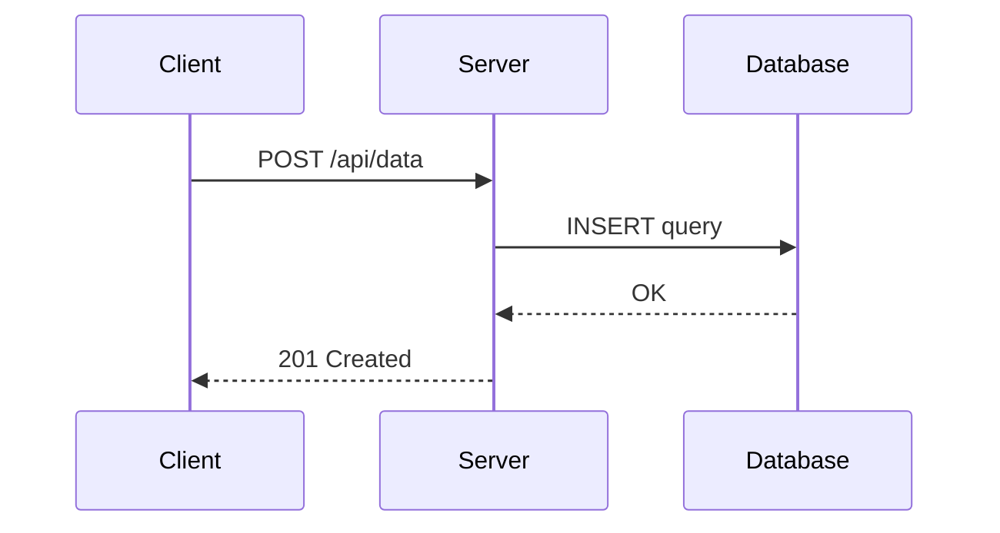
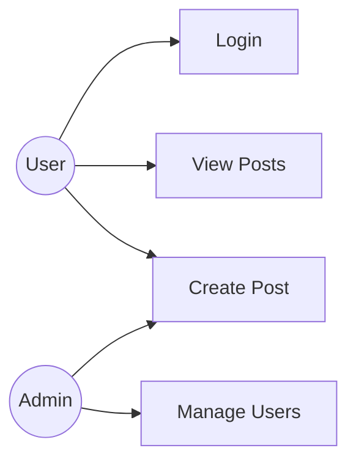

# Welcome

This blog supports **Markdown**, diagrams, math formulas, and function graphs.

## Diagrams with Mermaid

Sequence diagram:



Use case:



## Math with KaTeX

Inline: Euler's famous equation $e^{i\pi} + 1 = 0$.

Display mode:

$$
\int_{-\infty}^{\infty} e^{-x^2} dx = \sqrt{\pi}
$$

Bayes' theorem:

$$
P(A|B) = \frac{P(B|A) \cdot P(A)}{P(B)}
$$

## Graphs with Function Plot

Sine and cosine:

```functionplot
sin(x)
cos(x)
xDomain = [-2 * PI, 2 * PI]
yDomain = [-1.5, 1.5]
```

A parabola and its derivative:

```functionplot
x^2
2 * x
xDomain = [-3, 3]
yDomain = [-2, 9]
```

## Code

```python
def fibonacci(n):
    a, b = 0, 1
    for _ in range(n):
        a, b = b, a + b
    return a
```

## How to use

1. Create a `.md` file in `posts/` with front matter:
   ```yaml
   ---
   title: My Post
   date: 2026-03-24
   ---
   ```
2. Push to `main`
3. CI generates `posts.json` automatically
