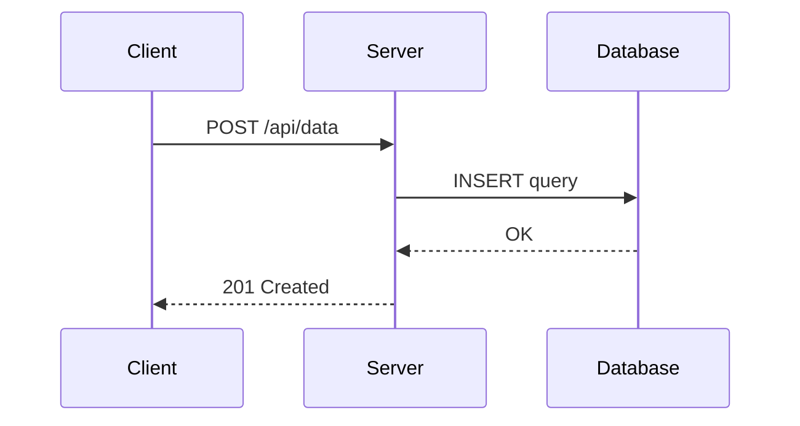
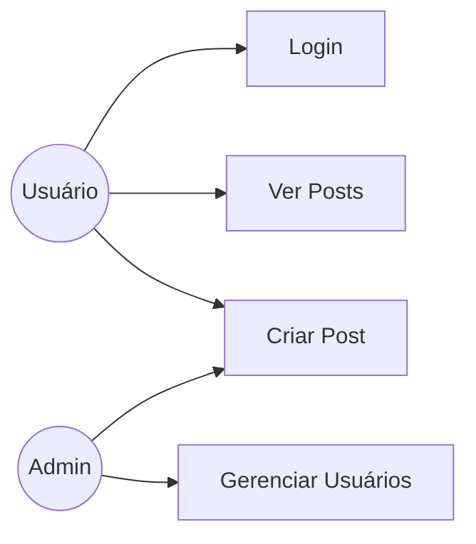

# Bem-vindo

Este blog suporta **Markdown**, diagramas e fórmulas matemáticas.

## Diagramas com Mermaid

Diagrama de sequência:



Caso de uso:



## Fórmulas com KaTeX

Inline: a famosa equação de Euler $e^{i\pi} + 1 = 0$.

Display mode:

$$
\int_{-\infty}^{\infty} e^{-x^2} dx = \sqrt{\pi}
$$

Bayes:

$$
P(A|B) = \frac{P(B|A) \cdot P(A)}{P(B)}
$$

## Código

```python
def fibonacci(n):
    a, b = 0, 1
    for _ in range(n):
        a, b = b, a + b
    return a
```

## Como usar

1. Crie um arquivo `.md` em `posts/` com front matter:
   ```yaml
   ---
   title: Meu Post
   date: 2026-03-24
   ---
   ```
2. Faça push para `main`
3. O CI gera o `posts.json` automaticamente
